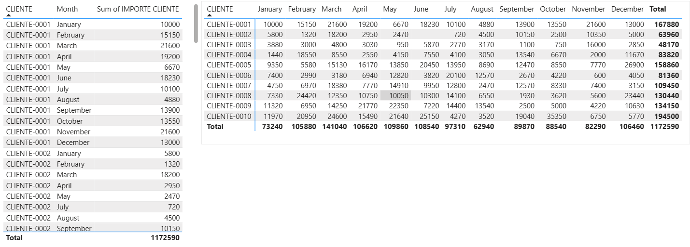
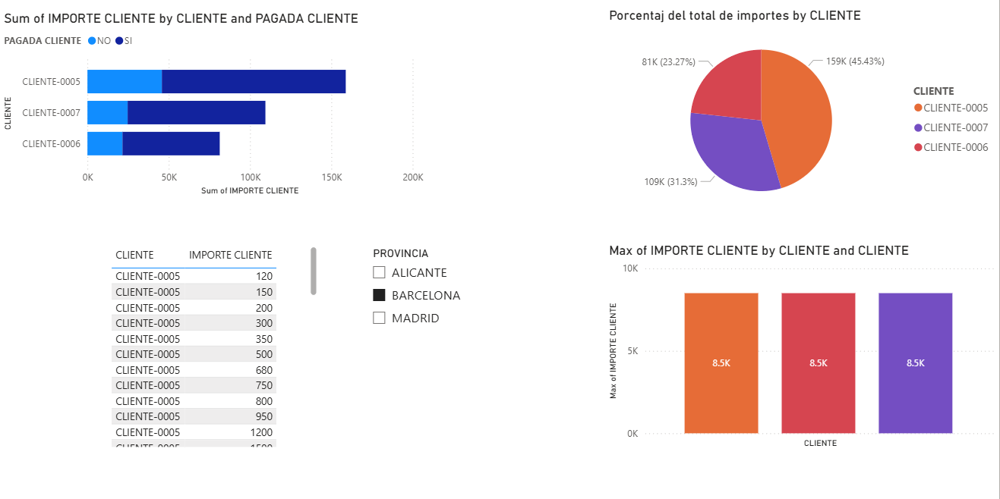
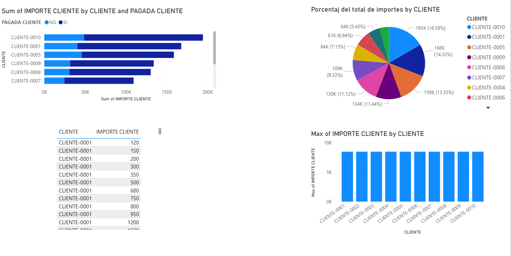
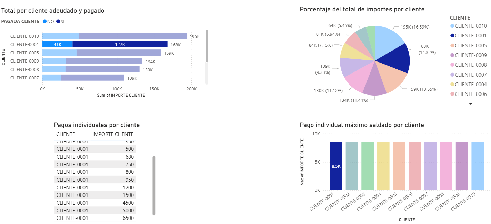
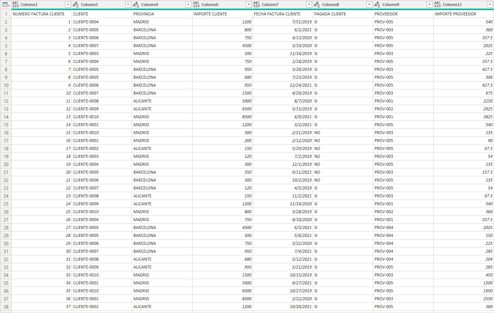
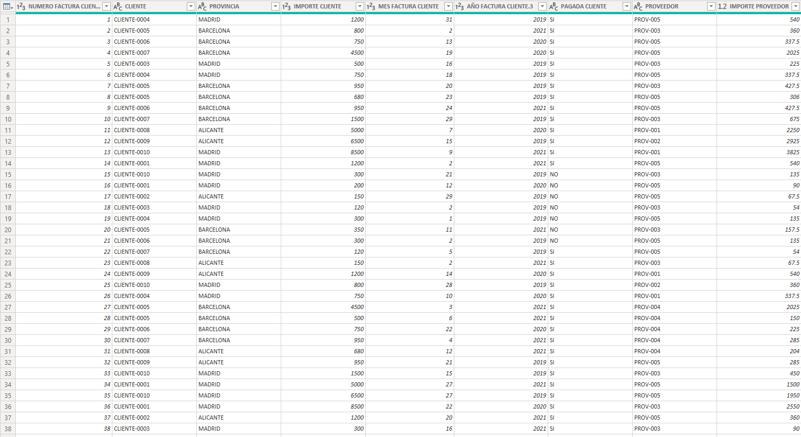
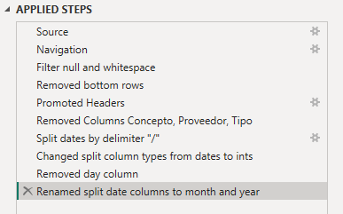

# Power BI

## Introducción

En este documento voy a intentar resumir todo lo que pueda relacionado a los
use cases de Power BI y una pseudo-documentación de lo que me parece más
interesante recordar, cabe notar que mucha información respecto al uso práctico
es operacional y por lo tanto difícil de desarrollar en texto, pero voy a hacer mi
mayor esfuerzo por ponerlo en palabras de la manera mas declarativa posible.

## ¿Qué es Power BI?

Es una aplicación de análisis y tratamiento de datos aplicado a los negocios. La
aplicación en sí nos deja conectar datos de distintos origenes y armar modelos
de datos relacionales.  
> Es importante notar que es una plataforma de visualización de datos y NO podemos modificar/eliminar ning´un registro desde la misma (los permisos otorgados son meramente de lectura)

## Importacion de Datos

Power BI tiene la ventaja de poder trabajar con distintos origenes de información en simultaneo, como mencionamos anteriormente. Algunas fuentes notorias son:

-   Archivos locales
    - Excel
    - CSV
    - JSON
  
-   Servidores remotos
    - AWS
    - MongoDB Atlas
    - Azure

>Cabe aclarar que ***la importación de los archivos no es equivalente a través de los distintos tipos*** y es importante saber de antemano que tipo de archivo vamos a importar.

## Tipos

Dentro de la visualización de nuestros datos podemos acceder a los tipos de cada columna en nuestra tabla *(Siempre y cuando este tipo sea deducible a través de los metadatos del archivo original)*, si bien podemos modificarlos es importante tener en cuenta que esto ***puede afectar la información de nuestro reporte*** ya que estariamos cambiando la interpretación que se le da y en situaciones particulares esto causa pérdidas *(Por ejemplo, cambiar números con decimal a números enteros pierde los décimos, incluso si luego revertimos a números decimales)*.   Por suerte siempre podemos recuperar la información refrescando la tabla y el esquema.

> Las pérdidas causadas por el cambio en los tipos solo impacta en la memoria del archivo de power BI y no en la fuente original.

## Transformaciones

Como bien dijimos en la [Introduccion](#introducción), Power BI no nos permite modificar la información contenida en las tablas. Sin embargo, algo que sí podemos hacer es transformar el formato de las columnas. Estas transformaciones no afectan la información de nuestro reporte particularmente debido a que estamos cambiando la representación visual de los datos y no la interpretación del mismo.

### Formatos Personalizados

Tenemos además la posibilidad de definir nuestros propios formatos para transformar la información recibida siempre y cuando esta sea de tipo numérico o fecha.

-   Numérico:
    -   `0`: Define la **cantidad mínima de dígitos** que debe contener el número, en caso de tener menos se rellena con ceros a la izquierda.
        -   Por ejemplo, con el formato `0000` ocurren las siguientes transformaciones:
            
            |Original|Transformado|
            |:-------:|:------:|
            |2000 | 2000| 
            |197 | 0197|
            |1 | 0001| 
            |15323 | 15323|

    -   `#` y `.`: Se utilizan en conjunto para definir el separador de miles
        -   Por ejemplo, con el formato `#.###` ocurre lo siguiente:
            
            |Original|Transformado|
            |:-------:|:------:|
            |2000 | 2.000|
            |197 | 197| 
            |1 | 1| 
            |15323 | 15.323|

    -   `""`: Permite introducir texto en los campos (Debe ir acompañado de un formato numérico) 
        -   Por ejemplo, el formato `#.#00,#0" Alumnos"`:

            |Original|Transformado|
            |:-------:|:------:|
            |2000,456 | 2.000,45 Alumnos |
            |197,1 | 197,1 Alumnos  |
            |1 | 01,0 Alumnos  |
            |15323 | 15.323,0 Alumnos  |

-   Fechas:
    -   Días
        -   `d` &rarr; Muestra los días con un dígito (1,2,3,...)
        -   `dd` &rarr; Muestra los días con dos dígitos (01,02,03,...)
        -   `ddd` &rarr; Muestra los días de la semana abreviados (lu,ma,mi,...)
        -   `dddd` &rarr; Muestra los días de la semana sin abreviar (lunes,martes,miércoles,...)
    -   Meses
        -   `m` &rarr; Muesta el mes en un dígito (1,2,3,...)
        -   `mm` &rarr; Muestra el mes en dos dígitos (01,02,03,...)
        -   `mmm` &rarr; Muestra el nombre del mes abreviado (ene,feb,mar,...)
        -   `mmmm` &rarr; Muestra el nombre del mes (enero, febrero, marzo, ...)
    -   Años
        -   `yy` &rarr; Muestra los dos últimos dígitos del año (15,16,17,...)
        -   `yyyy` &rarr; Muestra los cuatro dígitos del año (2015,2016,2017,...)

    -   `""`: Al igual que en los números permite agregar texto en los campos
        -   Por ejemplo, el formato `dd " de " mmmm`:

            |Original|Transformado|
            |:-------:|:------:|
            | 12/11/2015 | 12 de diciembre  |
            | 1/02/2017 | 01 de febrero |
            | 07/12/1999 | 07 de diciembre  |
            | 01/01/2000 | 01 de enero  |
>  El separador de miles que se utiliza en Power BI es la coma y el separador decimal es el punto.

## Informes

Ahora podemos pasar a los informes, que no son más que ventanas con información gráfica. 

### Tipos

La plataforma nos da una *muy* amplia gama de visualizaciones para elegir y siempre cualquier grafico es bueno en el contexto adecuado. Lo más importante a tener en cuenta acá es poder mostrar la información de forma concreta, correcta, sin redundancias y más intuitiva posible. 

Veamos un caso donde un tipo de dato es más declarativo que otro para la cantidad de plata gastada en $\text{X}$ mes por $\text{Y}$ cliente. 

Es evidente que en esta situación utilizar una matríz es mucho mejor que una tabla, tenemos la información presentada de forma más compacta mientras que la tabla requiere _scrollear_  y reorganizarla múltiples veces para obtener la misma información. 

#### Segmentadores

Hago esta pequeña distinción ya que los segmentadores no dan información como tal, lo que hacen es filtrar todas las visualizaciones de la página de forma dinámica según los valores de algún campo.

En este ejemplo podemos segmentar la información específica a los clientes que operan en Barcelona.

### Operaciones

Podemos realizar distintas modificaciones a cada visualización particular.  

1. Renombres

    Muchas veces el nombre predeterminado del gráfico (o de la columna) no es adecuado para el contexto y podemos renombrar cualquiera de estos campos para aumentar la declaratividad.

2. Campos numéricos 

    Los campos numéricos de manera predeterminada van a estar resumidos aplicando la sumatoria de sus valores, esto es modificable _on the fly_ en cada gráfico particular para que muestre el promedio/máx/mín/desviación estándar/porcentaje o directamente los valores reales e individuales.

3. Filtrado

    Por otra parte tenemos la ventaja de poder aplicar rápidamente filtros para aislar información según valores en campos específicos y de forma general (para todas las visualizaciones) o individual (para visualizaciones particulares)

En este ejemplo vemos como al seleccionar un cliente particular (filtro general) para ver como nos resalta su información específica. 
En simultaneo, gracias a que el gráfico de barras verticales `Pago individual máximo saldado por cliente` tiene un filtro de `PAGADO = Si` (filtro individual) tenemos una doble capa de filtrado que nos da más información.  
_Veamos además como aplicar ciertas operaciones visuales nos facilitan la lectura del reporte_

1. **Reporte sin aislar clientes particulares**
    

2. **Reporte aislando clientes particulares**

# Power Query

Toda esta información sobre la que trabajamos es traída de una base de datos (ya sea en formato de archivo o servidor) mediante power query. Esta herramienta nos permite realizar una serie de pasos transformativos sobre la información acorde a nuestra conveniencia ***sin modificar la fuente original***.

Dentro de las transformaciones disponibles tenemos:
-   Eliminar y Renombrar columnas
-   Eliminar filas (En base a algún criterio, ya sea que contiene errores, esten duplicadas o vacias y cualquier otro filtro en base a valores)
-   Cambiar tipos
-   Copiar tablas
-   Cambiar origen de datos
-   Formatear columnas (Dividir, unir, formato de valores)

Todo esto ocurre en una lista de pasos que es modificable en cualquier punto (con las consecuencias que la modificacion trae), pudiendo agregar pasos intermedios o quitar previos.

Un pequeño ejemplo en el que eliminamos, dividmos y renombramos columnas, modificamos tipos y asignamos como headers la primera fila.  

1. **Tabla Original**  

2. **Tabla Modificada** 

3.  **Lista de pasos *(renombrados)*** 
